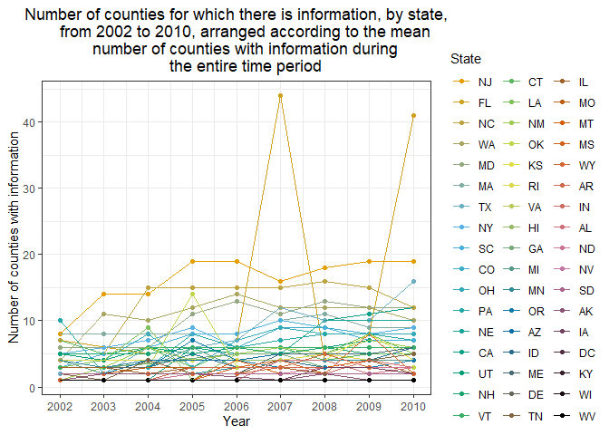
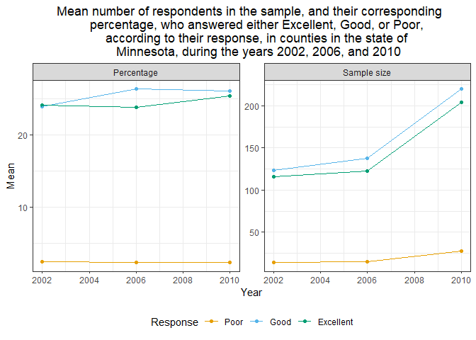

PubH7462 - Homework 2
================
Andrés Arguedas
10/2/2022

-   [BRFSS SMART 2002-2010](#brfss-smart-2002-2010)
    -   [Data Exploration & Cleaning](#data-exploration--cleaning)
    -   [Data Description](#data-description)
    -   [Do Data Science](#do-data-science)

## BRFSS SMART 2002-2010

### Data Exploration & Cleaning

First, we will start by loading the `brfss_smart_2010.csv` file into R
as the object `brfss_smart_2010`. Since the data comes in a .csv file,
then we can make use of the `read_csv()` function from the `readr`
package to load it into R as a tibble, as follows:

``` r
# Load the BRFSS SMART data into R. Since the original data is in a .csv format,
# then we can use the `read_csv()` function from the `readr` package to load it
# as a tibble into R
brfss_smart_2010 <- read_csv("./data/brfss_smart_2010.csv")
```

Having loaded the data, we can proceed to clean the variable names,
select only the “Overall Health” question, obtain the county for which
the data was obtained, and only select the variables of interest. We
will call this object `brfss_smart_tidy`, which can be constructed with
the following code:

``` r
brfss_smart_tidy <- brfss_smart_2010 %>%
  # Rename variables for ease of use when cleaning
  rename(
    LocationAbbr = Locationabbr,
    LocationDesc = Locationdesc,
    RespId = RESPID
  ) %>%
  # Clean variable names
  janitor::clean_names() %>%
  # Select only the "Overall Health" topic
  filter(topic %in% "Overall Health") %>%
  # Extract the county from the `location_desc` variable
  mutate(county = str_extract(location_desc, "(?<=-).*")) %>%
  # Leave only the `year`, `state`, `county`, `response`, `sample_size`, and
  # `data_value` variables
  dplyr::select(year, state = location_abbr, county, response, sample_size,
    percentage = data_value
  ) %>%
  mutate(
    # year = factor(year),
    state = factor(state),
    county = factor(county),
    response = factor(response),
    response = fct_relevel(
      response, "Poor", "Fair", "Good", "Very good",
      "Excellent"
    )
  )
```

Having loaded and cleaned the data of interest, we can proceed with the
rest of the desired analyses.

### Data Description

The data set contains a total of 10625 observations and 6 variables. In
this case, every observation corresponds to information for a particular
response from the survey to the “Overall Health” question, in a specific
county, state, and year. Therefore, we have the following variables:

| **Variable**  | **Description**                                                                                                            |
|---------------|----------------------------------------------------------------------------------------------------------------------------|
| `year`        | Year during which the data was collected. Takes values from 2002-2010                                                      |
| `state`       | State where the data was collected                                                                                         |
| `county`      | County where the data was collected                                                                                        |
| `response`    | Response to the Overall Health question. Can takes values of **Poor**, **Fair**, **Good**, **Very Good**, or **Excellent** |
| `sample_size` | Number of respondents from the county who answered with the specified level                                                |
| `percentage`  | Percentage of the respondents from the county who answered with the specified level                                        |

It’s important to note that, although the number of counties for which
there is information changes from year to year, and thus not all
counties are included in this data set, and some, even when included,
might not have information for all years in the study.

### Do Data Science

To start off, we will determine for which states there was infomation
from 6 counties during 2004. The following table presents this
information:

``` r
brfss_smart_tidy %>%
  filter(year == 2004) %>%
  group_by(state) %>%
  distinct(state, county) %>%
  summarise(number_counties = n()) %>%
  filter(number_counties >= 6) %>%
  arrange(desc(number_counties)) %>%
  mutate(state = abbr2state(state)) %>%
  gt() %>%
  tab_header(
    title = "States for which there is information on more than 6 counties in
    2004, by number of counties with information"
  ) %>%
  cols_label(
    state = md("**State**"), number_counties = md("**Number of counties**")
  ) %>%
  cols_align(align = "left", columns = state) %>%
  cols_align(align = "center", columns = number_counties)
```

<div id="hleniocpsv" style="overflow-x:auto;overflow-y:auto;width:auto;height:auto;">
<style>html {
  font-family: -apple-system, BlinkMacSystemFont, 'Segoe UI', Roboto, Oxygen, Ubuntu, Cantarell, 'Helvetica Neue', 'Fira Sans', 'Droid Sans', Arial, sans-serif;
}

#hleniocpsv .gt_table {
  display: table;
  border-collapse: collapse;
  margin-left: auto;
  margin-right: auto;
  color: #333333;
  font-size: 16px;
  font-weight: normal;
  font-style: normal;
  background-color: #FFFFFF;
  width: auto;
  border-top-style: solid;
  border-top-width: 2px;
  border-top-color: #A8A8A8;
  border-right-style: none;
  border-right-width: 2px;
  border-right-color: #D3D3D3;
  border-bottom-style: solid;
  border-bottom-width: 2px;
  border-bottom-color: #A8A8A8;
  border-left-style: none;
  border-left-width: 2px;
  border-left-color: #D3D3D3;
}

#hleniocpsv .gt_heading {
  background-color: #FFFFFF;
  text-align: center;
  border-bottom-color: #FFFFFF;
  border-left-style: none;
  border-left-width: 1px;
  border-left-color: #D3D3D3;
  border-right-style: none;
  border-right-width: 1px;
  border-right-color: #D3D3D3;
}

#hleniocpsv .gt_title {
  color: #333333;
  font-size: 125%;
  font-weight: initial;
  padding-top: 4px;
  padding-bottom: 4px;
  border-bottom-color: #FFFFFF;
  border-bottom-width: 0;
}

#hleniocpsv .gt_subtitle {
  color: #333333;
  font-size: 85%;
  font-weight: initial;
  padding-top: 0;
  padding-bottom: 6px;
  border-top-color: #FFFFFF;
  border-top-width: 0;
}

#hleniocpsv .gt_bottom_border {
  border-bottom-style: solid;
  border-bottom-width: 2px;
  border-bottom-color: #D3D3D3;
}

#hleniocpsv .gt_col_headings {
  border-top-style: solid;
  border-top-width: 2px;
  border-top-color: #D3D3D3;
  border-bottom-style: solid;
  border-bottom-width: 2px;
  border-bottom-color: #D3D3D3;
  border-left-style: none;
  border-left-width: 1px;
  border-left-color: #D3D3D3;
  border-right-style: none;
  border-right-width: 1px;
  border-right-color: #D3D3D3;
}

#hleniocpsv .gt_col_heading {
  color: #333333;
  background-color: #FFFFFF;
  font-size: 100%;
  font-weight: normal;
  text-transform: inherit;
  border-left-style: none;
  border-left-width: 1px;
  border-left-color: #D3D3D3;
  border-right-style: none;
  border-right-width: 1px;
  border-right-color: #D3D3D3;
  vertical-align: bottom;
  padding-top: 5px;
  padding-bottom: 6px;
  padding-left: 5px;
  padding-right: 5px;
  overflow-x: hidden;
}

#hleniocpsv .gt_column_spanner_outer {
  color: #333333;
  background-color: #FFFFFF;
  font-size: 100%;
  font-weight: normal;
  text-transform: inherit;
  padding-top: 0;
  padding-bottom: 0;
  padding-left: 4px;
  padding-right: 4px;
}

#hleniocpsv .gt_column_spanner_outer:first-child {
  padding-left: 0;
}

#hleniocpsv .gt_column_spanner_outer:last-child {
  padding-right: 0;
}

#hleniocpsv .gt_column_spanner {
  border-bottom-style: solid;
  border-bottom-width: 2px;
  border-bottom-color: #D3D3D3;
  vertical-align: bottom;
  padding-top: 5px;
  padding-bottom: 5px;
  overflow-x: hidden;
  display: inline-block;
  width: 100%;
}

#hleniocpsv .gt_group_heading {
  padding: 8px;
  color: #333333;
  background-color: #FFFFFF;
  font-size: 100%;
  font-weight: initial;
  text-transform: inherit;
  border-top-style: solid;
  border-top-width: 2px;
  border-top-color: #D3D3D3;
  border-bottom-style: solid;
  border-bottom-width: 2px;
  border-bottom-color: #D3D3D3;
  border-left-style: none;
  border-left-width: 1px;
  border-left-color: #D3D3D3;
  border-right-style: none;
  border-right-width: 1px;
  border-right-color: #D3D3D3;
  vertical-align: middle;
}

#hleniocpsv .gt_empty_group_heading {
  padding: 0.5px;
  color: #333333;
  background-color: #FFFFFF;
  font-size: 100%;
  font-weight: initial;
  border-top-style: solid;
  border-top-width: 2px;
  border-top-color: #D3D3D3;
  border-bottom-style: solid;
  border-bottom-width: 2px;
  border-bottom-color: #D3D3D3;
  vertical-align: middle;
}

#hleniocpsv .gt_from_md > :first-child {
  margin-top: 0;
}

#hleniocpsv .gt_from_md > :last-child {
  margin-bottom: 0;
}

#hleniocpsv .gt_row {
  padding-top: 8px;
  padding-bottom: 8px;
  padding-left: 5px;
  padding-right: 5px;
  margin: 10px;
  border-top-style: solid;
  border-top-width: 1px;
  border-top-color: #D3D3D3;
  border-left-style: none;
  border-left-width: 1px;
  border-left-color: #D3D3D3;
  border-right-style: none;
  border-right-width: 1px;
  border-right-color: #D3D3D3;
  vertical-align: middle;
  overflow-x: hidden;
}

#hleniocpsv .gt_stub {
  color: #333333;
  background-color: #FFFFFF;
  font-size: 100%;
  font-weight: initial;
  text-transform: inherit;
  border-right-style: solid;
  border-right-width: 2px;
  border-right-color: #D3D3D3;
  padding-left: 12px;
}

#hleniocpsv .gt_stub_row_group {
  color: #333333;
  background-color: #FFFFFF;
  font-size: 100%;
  font-weight: initial;
  text-transform: inherit;
  border-right-style: solid;
  border-right-width: 2px;
  border-right-color: #D3D3D3;
  padding-left: 12px;
  vertical-align: top;
}

#hleniocpsv .gt_row_group_first td {
  border-top-width: 2px;
}

#hleniocpsv .gt_summary_row {
  color: #333333;
  background-color: #FFFFFF;
  text-transform: inherit;
  padding-top: 8px;
  padding-bottom: 8px;
  padding-left: 5px;
  padding-right: 5px;
}

#hleniocpsv .gt_first_summary_row {
  border-top-style: solid;
  border-top-color: #D3D3D3;
}

#hleniocpsv .gt_first_summary_row.thick {
  border-top-width: 2px;
}

#hleniocpsv .gt_last_summary_row {
  padding-top: 8px;
  padding-bottom: 8px;
  padding-left: 5px;
  padding-right: 5px;
  border-bottom-style: solid;
  border-bottom-width: 2px;
  border-bottom-color: #D3D3D3;
}

#hleniocpsv .gt_grand_summary_row {
  color: #333333;
  background-color: #FFFFFF;
  text-transform: inherit;
  padding-top: 8px;
  padding-bottom: 8px;
  padding-left: 5px;
  padding-right: 5px;
}

#hleniocpsv .gt_first_grand_summary_row {
  padding-top: 8px;
  padding-bottom: 8px;
  padding-left: 5px;
  padding-right: 5px;
  border-top-style: double;
  border-top-width: 6px;
  border-top-color: #D3D3D3;
}

#hleniocpsv .gt_striped {
  background-color: rgba(128, 128, 128, 0.05);
}

#hleniocpsv .gt_table_body {
  border-top-style: solid;
  border-top-width: 2px;
  border-top-color: #D3D3D3;
  border-bottom-style: solid;
  border-bottom-width: 2px;
  border-bottom-color: #D3D3D3;
}

#hleniocpsv .gt_footnotes {
  color: #333333;
  background-color: #FFFFFF;
  border-bottom-style: none;
  border-bottom-width: 2px;
  border-bottom-color: #D3D3D3;
  border-left-style: none;
  border-left-width: 2px;
  border-left-color: #D3D3D3;
  border-right-style: none;
  border-right-width: 2px;
  border-right-color: #D3D3D3;
}

#hleniocpsv .gt_footnote {
  margin: 0px;
  font-size: 90%;
  padding: 4px;
}

#hleniocpsv .gt_sourcenotes {
  color: #333333;
  background-color: #FFFFFF;
  border-bottom-style: none;
  border-bottom-width: 2px;
  border-bottom-color: #D3D3D3;
  border-left-style: none;
  border-left-width: 2px;
  border-left-color: #D3D3D3;
  border-right-style: none;
  border-right-width: 2px;
  border-right-color: #D3D3D3;
}

#hleniocpsv .gt_sourcenote {
  font-size: 90%;
  padding: 4px;
}

#hleniocpsv .gt_left {
  text-align: left;
}

#hleniocpsv .gt_center {
  text-align: center;
}

#hleniocpsv .gt_right {
  text-align: right;
  font-variant-numeric: tabular-nums;
}

#hleniocpsv .gt_font_normal {
  font-weight: normal;
}

#hleniocpsv .gt_font_bold {
  font-weight: bold;
}

#hleniocpsv .gt_font_italic {
  font-style: italic;
}

#hleniocpsv .gt_super {
  font-size: 65%;
}

#hleniocpsv .gt_footnote_marks {
  font-style: italic;
  font-weight: normal;
  font-size: 75%;
  vertical-align: 0.4em;
}

#hleniocpsv .gt_asterisk {
  font-size: 100%;
  vertical-align: 0;
}

#hleniocpsv .gt_slash_mark {
  font-size: 0.7em;
  line-height: 0.7em;
  vertical-align: 0.15em;
}

#hleniocpsv .gt_fraction_numerator {
  font-size: 0.6em;
  line-height: 0.6em;
  vertical-align: 0.45em;
}

#hleniocpsv .gt_fraction_denominator {
  font-size: 0.6em;
  line-height: 0.6em;
  vertical-align: -0.05em;
}
</style>
<table class="gt_table">
  <thead class="gt_header">
    <tr>
      <th colspan="2" class="gt_heading gt_title gt_font_normal gt_bottom_border" style>States for which there is information on more than 6 counties in
    2004, by number of counties with information</th>
    </tr>
    
  </thead>
  <thead class="gt_col_headings">
    <tr>
      <th class="gt_col_heading gt_columns_bottom_border gt_left" rowspan="1" colspan="1"><strong>State</strong></th>
      <th class="gt_col_heading gt_columns_bottom_border gt_center" rowspan="1" colspan="1"><strong>Number of counties</strong></th>
    </tr>
  </thead>
  <tbody class="gt_table_body">
    <tr><td class="gt_row gt_left">North Carolina</td>
<td class="gt_row gt_center">15</td></tr>
    <tr><td class="gt_row gt_left">New Jersey</td>
<td class="gt_row gt_center">14</td></tr>
    <tr><td class="gt_row gt_left">Washington</td>
<td class="gt_row gt_center">10</td></tr>
    <tr><td class="gt_row gt_left">Louisiana</td>
<td class="gt_row gt_center">9</td></tr>
    <tr><td class="gt_row gt_left">Massachusetts</td>
<td class="gt_row gt_center">8</td></tr>
    <tr><td class="gt_row gt_left">Ohio</td>
<td class="gt_row gt_center">8</td></tr>
    <tr><td class="gt_row gt_left">New York</td>
<td class="gt_row gt_center">7</td></tr>
    <tr><td class="gt_row gt_left">Colorado</td>
<td class="gt_row gt_center">6</td></tr>
    <tr><td class="gt_row gt_left">Connecticut</td>
<td class="gt_row gt_center">6</td></tr>
    <tr><td class="gt_row gt_left">Maryland</td>
<td class="gt_row gt_center">6</td></tr>
    <tr><td class="gt_row gt_left">New Mexico</td>
<td class="gt_row gt_center">6</td></tr>
    <tr><td class="gt_row gt_left">South Carolina</td>
<td class="gt_row gt_center">6</td></tr>
    <tr><td class="gt_row gt_left">Texas</td>
<td class="gt_row gt_center">6</td></tr>
    <tr><td class="gt_row gt_left">Utah</td>
<td class="gt_row gt_center">6</td></tr>
    <tr><td class="gt_row gt_left">Vermont</td>
<td class="gt_row gt_center">6</td></tr>
  </tbody>
  
  
</table>
</div>

As we can see, there’s a total of 15 states with information on more
than 6 counties, up to a total of 15 counties. Specifically, there are 8
states for which we have information on exactly 6 counties for 2004:
Colorado, Connecticut, Maryland, New Mexico, South Carolina, Texas,
Utah, Vermont. More generally, if we wanted to examine the number of
counties for which there is information available, for every state and
year, then we can make use of a “spaghetti plot”, as presented below:

``` r
big.palette <- colorRampPalette(c(
  "#E69F00", "#56B4E9", "#009E73", "#F0E442",
  "#0072B2", "#D55E00", "#CC79A7", "#000000"
))
brfss_smart_tidy %>%
  group_by(state, year) %>%
  distinct(year, state, county) %>%
  summarise(number_counties = n()) %>%
  ungroup() %>%
  mutate(state = fct_reorder(state, number_counties, mean, .desc = TRUE)) %>%
  ggplot(aes(x = year, y = number_counties, group = state, col = state)) +
  scale_colour_manual(values = big.palette(51)) +
  geom_point() +
  geom_line() +
  scale_x_continuous(breaks = seq(2002, 2010, by = 1)) +
  labs(
    title = "Number of counties for which there is information, by state,
    from 2002 to 2010, arranged according to the mean
    number of counties with information during
    the entire time period",
    x = "Year",
    y = "Number of counties with information",
    col = "State"
  ) +
  theme(legend.position = "right")
```

<!-- -->

From the above plot we can determine that the state with the highest
number of counties for which information is available from 2002 to 2010
is New Jersey with 16.2222 counties, on average, while District of
Columbia, Kentucky, Wisconsin, West Virginia have information on 1
county, on average. Overall, from the figure, it seems like the number
of counties with information is relatively stable, and mostly
increasing, as the years go on, however this isn’t always the case. For
example, for New Jersey, the number of counties seems to be similar for
all years, but in the case of Florida, the state with the second highest
number of counties with information, we can see that there are two peaks
in 2007 and 2010, which can inflate the mean.

Moving on from the number of counties with information, we can also be
interested in determining the number of people sampled, and the
percentage to which they correspond, who responded for each category in
Minnesota. Specifically, we will work with responses that were
**Excellent**, **Good**, or **Poor**, and pool the results from all
counties in the state to obtain a mean and a standard deviation, for the
years 2002, 2006, and 2010. These results are presented in the following
table:

``` r
mean_table <- brfss_smart_tidy %>%
  filter(
    year %in% c(2002, 2006, 2010), state %in% "MN",
    response %in% c("Excellent", "Good", "Poor")
  ) %>%
  group_by(year, response) %>%
  summarise(across(
    c(sample_size, percentage),
    list(mean = mean, sd = sd)
  ))

mean_table %>%
  gt() %>%
  tab_header(title = "Mean and standard deviation of the number of respondents
             in the sample who answered either Excellent, Good, or Poor, as well
             as their corresponding percentage in the overall sample, in 
             counties in the state of Minnesota, during the years 2002, 2006, 
             and 2010") %>%
  tab_spanner(
    label = md("**Sample size**"),
    columns = c(sample_size_mean, sample_size_sd)
  ) %>%
  tab_spanner(
    label = md("**Percentage**"),
    columns = c(percentage_mean, percentage_sd)
  ) %>%
  cols_label(
    sample_size_mean = md("**Mean**"),
    sample_size_sd = md("**Std. Deviation**"),
    percentage_mean = md("**Mean**"),
    percentage_sd = md("**Std. Deviation**"),
    response = md("**Response**")
  ) %>%
  tab_stubhead(label = md("**Year**")) %>%
  cols_align(align = "center", columns = contains(c("mean", "sd"))) %>%
  # Need the development version of package `gt` to use this option!!! Run:
  # `devtools::install_github("rstudio/gt")`
  tab_options(row_group.as_column = TRUE)
```

<div id="yepxfjcfrt" style="overflow-x:auto;overflow-y:auto;width:auto;height:auto;">
<style>html {
  font-family: -apple-system, BlinkMacSystemFont, 'Segoe UI', Roboto, Oxygen, Ubuntu, Cantarell, 'Helvetica Neue', 'Fira Sans', 'Droid Sans', Arial, sans-serif;
}

#yepxfjcfrt .gt_table {
  display: table;
  border-collapse: collapse;
  margin-left: auto;
  margin-right: auto;
  color: #333333;
  font-size: 16px;
  font-weight: normal;
  font-style: normal;
  background-color: #FFFFFF;
  width: auto;
  border-top-style: solid;
  border-top-width: 2px;
  border-top-color: #A8A8A8;
  border-right-style: none;
  border-right-width: 2px;
  border-right-color: #D3D3D3;
  border-bottom-style: solid;
  border-bottom-width: 2px;
  border-bottom-color: #A8A8A8;
  border-left-style: none;
  border-left-width: 2px;
  border-left-color: #D3D3D3;
}

#yepxfjcfrt .gt_heading {
  background-color: #FFFFFF;
  text-align: center;
  border-bottom-color: #FFFFFF;
  border-left-style: none;
  border-left-width: 1px;
  border-left-color: #D3D3D3;
  border-right-style: none;
  border-right-width: 1px;
  border-right-color: #D3D3D3;
}

#yepxfjcfrt .gt_title {
  color: #333333;
  font-size: 125%;
  font-weight: initial;
  padding-top: 4px;
  padding-bottom: 4px;
  border-bottom-color: #FFFFFF;
  border-bottom-width: 0;
}

#yepxfjcfrt .gt_subtitle {
  color: #333333;
  font-size: 85%;
  font-weight: initial;
  padding-top: 0;
  padding-bottom: 6px;
  border-top-color: #FFFFFF;
  border-top-width: 0;
}

#yepxfjcfrt .gt_bottom_border {
  border-bottom-style: solid;
  border-bottom-width: 2px;
  border-bottom-color: #D3D3D3;
}

#yepxfjcfrt .gt_col_headings {
  border-top-style: solid;
  border-top-width: 2px;
  border-top-color: #D3D3D3;
  border-bottom-style: solid;
  border-bottom-width: 2px;
  border-bottom-color: #D3D3D3;
  border-left-style: none;
  border-left-width: 1px;
  border-left-color: #D3D3D3;
  border-right-style: none;
  border-right-width: 1px;
  border-right-color: #D3D3D3;
}

#yepxfjcfrt .gt_col_heading {
  color: #333333;
  background-color: #FFFFFF;
  font-size: 100%;
  font-weight: normal;
  text-transform: inherit;
  border-left-style: none;
  border-left-width: 1px;
  border-left-color: #D3D3D3;
  border-right-style: none;
  border-right-width: 1px;
  border-right-color: #D3D3D3;
  vertical-align: bottom;
  padding-top: 5px;
  padding-bottom: 6px;
  padding-left: 5px;
  padding-right: 5px;
  overflow-x: hidden;
}

#yepxfjcfrt .gt_column_spanner_outer {
  color: #333333;
  background-color: #FFFFFF;
  font-size: 100%;
  font-weight: normal;
  text-transform: inherit;
  padding-top: 0;
  padding-bottom: 0;
  padding-left: 4px;
  padding-right: 4px;
}

#yepxfjcfrt .gt_column_spanner_outer:first-child {
  padding-left: 0;
}

#yepxfjcfrt .gt_column_spanner_outer:last-child {
  padding-right: 0;
}

#yepxfjcfrt .gt_column_spanner {
  border-bottom-style: solid;
  border-bottom-width: 2px;
  border-bottom-color: #D3D3D3;
  vertical-align: bottom;
  padding-top: 5px;
  padding-bottom: 5px;
  overflow-x: hidden;
  display: inline-block;
  width: 100%;
}

#yepxfjcfrt .gt_group_heading {
  padding: 8px;
  color: #333333;
  background-color: #FFFFFF;
  font-size: 100%;
  font-weight: initial;
  text-transform: inherit;
  border-top-style: solid;
  border-top-width: 2px;
  border-top-color: #D3D3D3;
  border-bottom-style: solid;
  border-bottom-width: 2px;
  border-bottom-color: #D3D3D3;
  border-left-style: none;
  border-left-width: 1px;
  border-left-color: #D3D3D3;
  border-right-style: none;
  border-right-width: 1px;
  border-right-color: #D3D3D3;
  vertical-align: middle;
}

#yepxfjcfrt .gt_empty_group_heading {
  padding: 0.5px;
  color: #333333;
  background-color: #FFFFFF;
  font-size: 100%;
  font-weight: initial;
  border-top-style: solid;
  border-top-width: 2px;
  border-top-color: #D3D3D3;
  border-bottom-style: solid;
  border-bottom-width: 2px;
  border-bottom-color: #D3D3D3;
  vertical-align: middle;
}

#yepxfjcfrt .gt_from_md > :first-child {
  margin-top: 0;
}

#yepxfjcfrt .gt_from_md > :last-child {
  margin-bottom: 0;
}

#yepxfjcfrt .gt_row {
  padding-top: 8px;
  padding-bottom: 8px;
  padding-left: 5px;
  padding-right: 5px;
  margin: 10px;
  border-top-style: solid;
  border-top-width: 1px;
  border-top-color: #D3D3D3;
  border-left-style: none;
  border-left-width: 1px;
  border-left-color: #D3D3D3;
  border-right-style: none;
  border-right-width: 1px;
  border-right-color: #D3D3D3;
  vertical-align: middle;
  overflow-x: hidden;
}

#yepxfjcfrt .gt_stub {
  color: #333333;
  background-color: #FFFFFF;
  font-size: 100%;
  font-weight: initial;
  text-transform: inherit;
  border-right-style: solid;
  border-right-width: 2px;
  border-right-color: #D3D3D3;
  padding-left: 12px;
}

#yepxfjcfrt .gt_stub_row_group {
  color: #333333;
  background-color: #FFFFFF;
  font-size: 100%;
  font-weight: initial;
  text-transform: inherit;
  border-right-style: solid;
  border-right-width: 2px;
  border-right-color: #D3D3D3;
  padding-left: 12px;
  vertical-align: top;
}

#yepxfjcfrt .gt_row_group_first td {
  border-top-width: 2px;
}

#yepxfjcfrt .gt_summary_row {
  color: #333333;
  background-color: #FFFFFF;
  text-transform: inherit;
  padding-top: 8px;
  padding-bottom: 8px;
  padding-left: 5px;
  padding-right: 5px;
}

#yepxfjcfrt .gt_first_summary_row {
  border-top-style: solid;
  border-top-color: #D3D3D3;
}

#yepxfjcfrt .gt_first_summary_row.thick {
  border-top-width: 2px;
}

#yepxfjcfrt .gt_last_summary_row {
  padding-top: 8px;
  padding-bottom: 8px;
  padding-left: 5px;
  padding-right: 5px;
  border-bottom-style: solid;
  border-bottom-width: 2px;
  border-bottom-color: #D3D3D3;
}

#yepxfjcfrt .gt_grand_summary_row {
  color: #333333;
  background-color: #FFFFFF;
  text-transform: inherit;
  padding-top: 8px;
  padding-bottom: 8px;
  padding-left: 5px;
  padding-right: 5px;
}

#yepxfjcfrt .gt_first_grand_summary_row {
  padding-top: 8px;
  padding-bottom: 8px;
  padding-left: 5px;
  padding-right: 5px;
  border-top-style: double;
  border-top-width: 6px;
  border-top-color: #D3D3D3;
}

#yepxfjcfrt .gt_striped {
  background-color: rgba(128, 128, 128, 0.05);
}

#yepxfjcfrt .gt_table_body {
  border-top-style: solid;
  border-top-width: 2px;
  border-top-color: #D3D3D3;
  border-bottom-style: solid;
  border-bottom-width: 2px;
  border-bottom-color: #D3D3D3;
}

#yepxfjcfrt .gt_footnotes {
  color: #333333;
  background-color: #FFFFFF;
  border-bottom-style: none;
  border-bottom-width: 2px;
  border-bottom-color: #D3D3D3;
  border-left-style: none;
  border-left-width: 2px;
  border-left-color: #D3D3D3;
  border-right-style: none;
  border-right-width: 2px;
  border-right-color: #D3D3D3;
}

#yepxfjcfrt .gt_footnote {
  margin: 0px;
  font-size: 90%;
  padding: 4px;
}

#yepxfjcfrt .gt_sourcenotes {
  color: #333333;
  background-color: #FFFFFF;
  border-bottom-style: none;
  border-bottom-width: 2px;
  border-bottom-color: #D3D3D3;
  border-left-style: none;
  border-left-width: 2px;
  border-left-color: #D3D3D3;
  border-right-style: none;
  border-right-width: 2px;
  border-right-color: #D3D3D3;
}

#yepxfjcfrt .gt_sourcenote {
  font-size: 90%;
  padding: 4px;
}

#yepxfjcfrt .gt_left {
  text-align: left;
}

#yepxfjcfrt .gt_center {
  text-align: center;
}

#yepxfjcfrt .gt_right {
  text-align: right;
  font-variant-numeric: tabular-nums;
}

#yepxfjcfrt .gt_font_normal {
  font-weight: normal;
}

#yepxfjcfrt .gt_font_bold {
  font-weight: bold;
}

#yepxfjcfrt .gt_font_italic {
  font-style: italic;
}

#yepxfjcfrt .gt_super {
  font-size: 65%;
}

#yepxfjcfrt .gt_footnote_marks {
  font-style: italic;
  font-weight: normal;
  font-size: 75%;
  vertical-align: 0.4em;
}

#yepxfjcfrt .gt_asterisk {
  font-size: 100%;
  vertical-align: 0;
}

#yepxfjcfrt .gt_slash_mark {
  font-size: 0.7em;
  line-height: 0.7em;
  vertical-align: 0.15em;
}

#yepxfjcfrt .gt_fraction_numerator {
  font-size: 0.6em;
  line-height: 0.6em;
  vertical-align: 0.45em;
}

#yepxfjcfrt .gt_fraction_denominator {
  font-size: 0.6em;
  line-height: 0.6em;
  vertical-align: -0.05em;
}
</style>
<table class="gt_table">
  <thead class="gt_header">
    <tr>
      <th colspan="6" class="gt_heading gt_title gt_font_normal gt_bottom_border" style>Mean and standard deviation of the number of respondents
             in the sample who answered either Excellent, Good, or Poor, as well
             as their corresponding percentage in the overall sample, in 
             counties in the state of Minnesota, during the years 2002, 2006, 
             and 2010</th>
    </tr>
    
  </thead>
  <thead class="gt_col_headings">
    <tr>
      <th class="gt_col_heading gt_columns_bottom_border gt_left" rowspan="2" colspan="1"><strong>Year</strong></th>
      <th class="gt_col_heading gt_columns_bottom_border gt_center" rowspan="2" colspan="1"><strong>Response</strong></th>
      <th class="gt_center gt_columns_top_border gt_column_spanner_outer" rowspan="1" colspan="2">
        <span class="gt_column_spanner"><strong>Sample size</strong></span>
      </th>
      <th class="gt_center gt_columns_top_border gt_column_spanner_outer" rowspan="1" colspan="2">
        <span class="gt_column_spanner"><strong>Percentage</strong></span>
      </th>
    </tr>
    <tr>
      <th class="gt_col_heading gt_columns_bottom_border gt_center" rowspan="1" colspan="1"><strong>Mean</strong></th>
      <th class="gt_col_heading gt_columns_bottom_border gt_center" rowspan="1" colspan="1"><strong>Std. Deviation</strong></th>
      <th class="gt_col_heading gt_columns_bottom_border gt_center" rowspan="1" colspan="1"><strong>Mean</strong></th>
      <th class="gt_col_heading gt_columns_bottom_border gt_center" rowspan="1" colspan="1"><strong>Std. Deviation</strong></th>
    </tr>
  </thead>
  <tbody class="gt_table_body">
    <tr class="gt_row_group_first"><td rowspan="3" class="gt_row gt_right gt_stub_row_group">2002</td>
<td class="gt_row gt_center">Poor</td>
<td class="gt_row gt_center">13.75</td>
<td class="gt_row gt_center">9.570</td>
<td class="gt_row gt_center">2.40</td>
<td class="gt_row gt_center">1.1690</td></tr>
    <tr><td class="gt_row gt_center">Good</td>
<td class="gt_row gt_center">123.75</td>
<td class="gt_row gt_center">84.263</td>
<td class="gt_row gt_center">23.95</td>
<td class="gt_row gt_center">1.0472</td></tr>
    <tr><td class="gt_row gt_center">Excellent</td>
<td class="gt_row gt_center">116.00</td>
<td class="gt_row gt_center">83.275</td>
<td class="gt_row gt_center">24.15</td>
<td class="gt_row gt_center">3.5407</td></tr>
    <tr class="gt_row_group_first"><td rowspan="3" class="gt_row gt_right gt_stub_row_group">2006</td>
<td class="gt_row gt_center">Poor</td>
<td class="gt_row gt_center">15.00</td>
<td class="gt_row gt_center">6.928</td>
<td class="gt_row gt_center">2.30</td>
<td class="gt_row gt_center">0.9539</td></tr>
    <tr><td class="gt_row gt_center">Good</td>
<td class="gt_row gt_center">137.33</td>
<td class="gt_row gt_center">85.816</td>
<td class="gt_row gt_center">26.37</td>
<td class="gt_row gt_center">0.4509</td></tr>
    <tr><td class="gt_row gt_center">Excellent</td>
<td class="gt_row gt_center">122.33</td>
<td class="gt_row gt_center">72.625</td>
<td class="gt_row gt_center">23.83</td>
<td class="gt_row gt_center">2.9872</td></tr>
    <tr class="gt_row_group_first"><td rowspan="3" class="gt_row gt_right gt_stub_row_group">2010</td>
<td class="gt_row gt_center">Poor</td>
<td class="gt_row gt_center">27.40</td>
<td class="gt_row gt_center">27.318</td>
<td class="gt_row gt_center">2.36</td>
<td class="gt_row gt_center">0.7701</td></tr>
    <tr><td class="gt_row gt_center">Good</td>
<td class="gt_row gt_center">220.00</td>
<td class="gt_row gt_center">196.099</td>
<td class="gt_row gt_center">26.04</td>
<td class="gt_row gt_center">3.5473</td></tr>
    <tr><td class="gt_row gt_center">Excellent</td>
<td class="gt_row gt_center">203.80</td>
<td class="gt_row gt_center">190.598</td>
<td class="gt_row gt_center">25.44</td>
<td class="gt_row gt_center">5.2776</td></tr>
  </tbody>
  
  
</table>
</div>

From the above table we can notice that, independent of the year, there
is a much smaller number of people who thought the overall health of the
state was poor, compared to those who thought it was good or excellent,
and furthermore the number of people who thought it was good or
excellent was also very similar. Moving now to the relative scale, we
can see that this trend also holds for the percentages of the sample
corresponding to said responses, with the Good and Excellent responses
having a much higher percentage than Poor, however this is relatively
stable across the years, unlike the absolute number. In terms of the
standard deviation, it increases greatly for all responses, and for both
variables, during 2010, which means that there is a much greater
variability in the responses for said year in the different counties
with information. We can further visually explore the trends for both
variables across time with the following plot:

``` r
mean_table %>%
  pivot_longer(contains(c("mean", "sd")),
    names_pattern = c("(sample_size|percentage)_(.*)"),
    names_to = c("variable", ".value")
  ) %>%
  mutate(variable = variable %>%
    str_replace("_", " ") %>%
    str_to_sentence()) %>%
  ggplot(aes(x = year, y = mean, col = response, group = response)) +
  facet_wrap(~variable, scales = "free_y") +
  geom_point() +
  geom_line() +
  labs(
    title = "Mean number of respondents in the sample, and their corresponding 
    percentage, who answered either Excellent, Good, or Poor, 
    according to their response, in counties in the state of 
    Minnesota, during the years 2002, 2006, and 2010",
    x = "Year",
    y = "Mean",
    col = "Response"
  )
```

<!-- -->

As we can see, overall Good and Excellent responses have a higher mean
compared to the Poor responses, and the mean is also similar between the
Good and Excellent responses. However, although these trends are
relatively stable across the years for the percentage, there is an
increases in 2010 for the absolute number of respondents for all
responses, which could in turn indicate an overall larger sample during
the last years of the study for which there is information.
